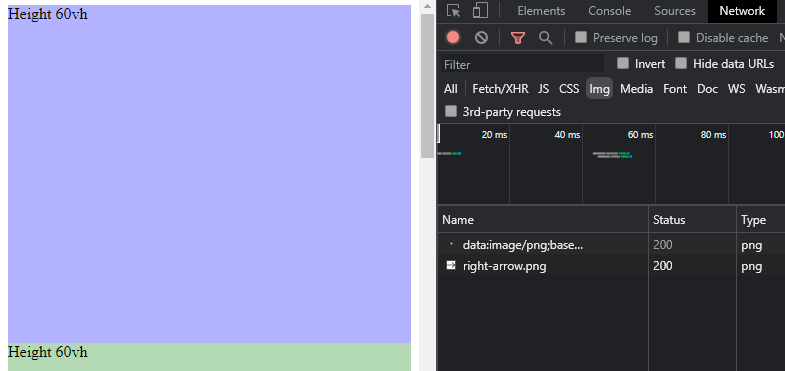
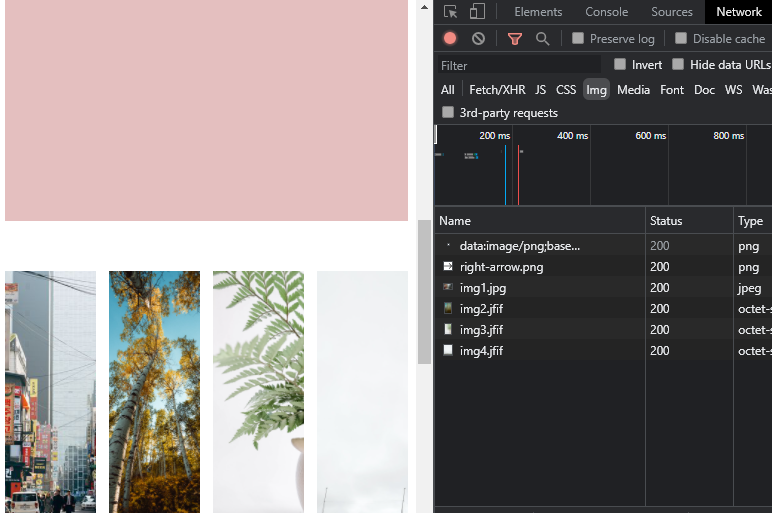

# Lazy Loading (demo)

## Các kỹ thuật tối ưu hiệu xuất dành cho hình ảnh (_`FrontEnd`_ + _`BackEnd`_ + _`Design`_)

- Chỉ load những hình ảnh cần thiết khi người dùng sử dụng Website.
- Tối ưu hình ảnh cho nhiều thiết bị với nhiều kích thước khác nhau: Mobile, Desktop.
- Vấn đề nên tránh trong hầu hết các trường hợp: Cumulative Layout Shift (CLS).

## **`Browser-level: lazy-loading, srcset`**

> https://developer.mozilla.org/en-US/docs/Web/HTML/Element/img

## **`Scroll`** và **`Resize event`**

> https://developer.mozilla.org/en-US/docs/Web/API/Element/getBoundingClientRect

## **`Intersection Observer`**

> https://developer.mozilla.org/en-US/docs/Web/API/Intersection_Observer_API

---

## Demo

Khi chưa scroll đến section chứa img:

Khi đã gặp section chứa img:

